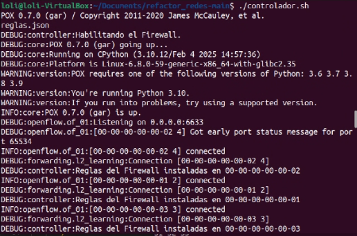
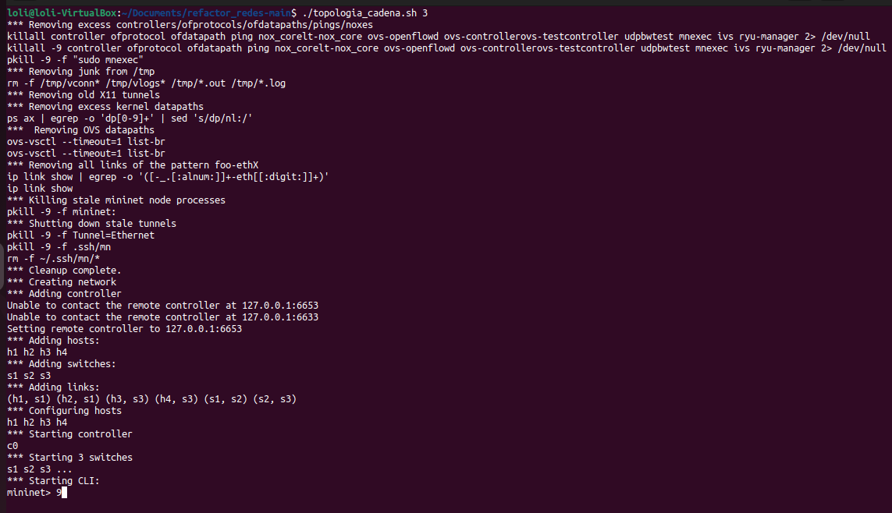
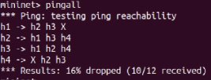
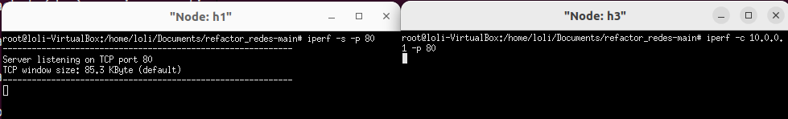
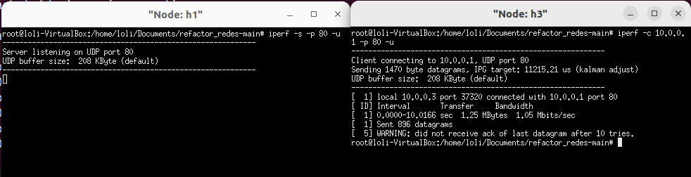
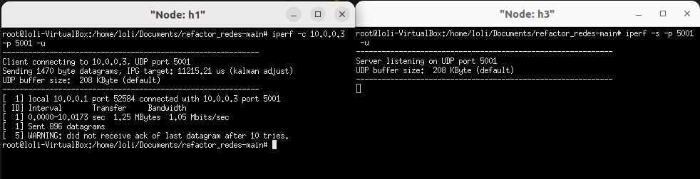
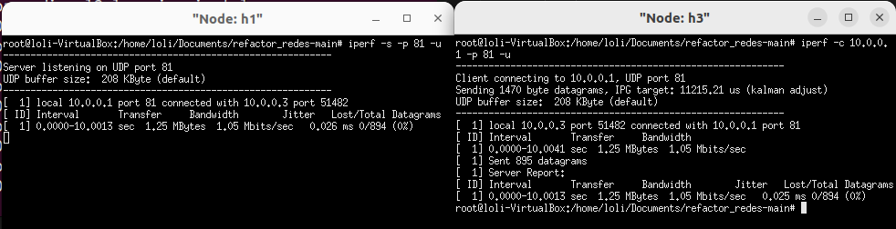
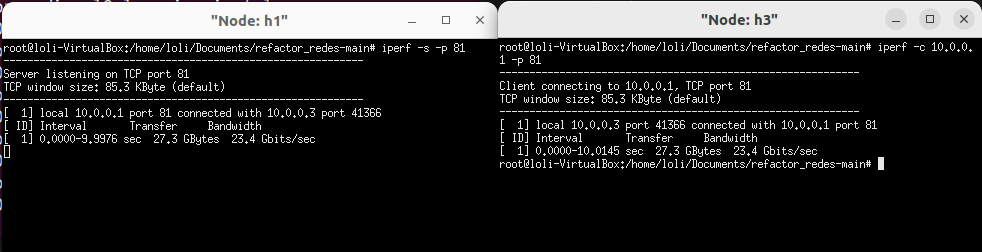

# Trabajo Práctico Nº2 'Software-Defined Networks'

## Materia: REDES (TA048)

## Grupo 1

### Integrantes:

| Alumno                  | Correo               | Padrón  |
|-------------------------|----------------------|---------|
| Ascencio Felipe Santino | fascencio@fi.uba.ar  | 110675  |
| Burgos Moreno Daniel    | dburgos@fi.uba.ar    | 110486  |
| García Pizales Ignacio  | igarciap@fi.uba.ar   | 105043  |
| Levi Dolores            | dolevi@fi.uba.ar     | 105993  |
| Orive María Sol         | morive@fi.uba.ar     | 91351   |

---

## Herramientas utilizadas

### POX

#### Explicación del directorio 'pox'

En el directorio 'pox' se encuentra el contenido original proveniente del sitio oficial del proyecto.

Todos los derechos de autor han sido respetados y no se realizaron modificaciones sobre los archivos originales.

La única incorporación propia es el archivo 'controller.py', en el cual se implementó el código necesario para resolver el enunciado del presente trabajo práctico.

#### Link a la página oficial

[Documentación oficial de POX](https://noxrepo.github.io/pox-doc/html/)

#### ¿Qué es POX?

POX es una plataforma de software escrita en Python diseñada para el desarrollo de controladores y aplicaciones de redes definidas por software (SDN), utilizando principalmente el protocolo OpenFlow.

Surgió como sucesor del controlador NOX y es ampliamente usado en entornos educativos e investigaciones gracias a su enfoque ligero y flexible.

#### Características principales

- **Controlador y switch en Python**: Inicialmente concebido como controlador OpenFlow, POX también puede funcionar como switch OpenFlow, ofreciendo una plataforma homogénea para construir software de red.
- **Soporte para OpenFlow 1.0 y extensiones OVS/Nicira**: Maneja el protocolo OpenFlow versión 1.0 y cuenta con soporte para extensiones específicas de Open vSwitch.
- **Componentes modulares**: POX usa componentes en Python (como `forwarding.l2_learning`, `log.level` o `discovery`) que se pueden combinar al iniciarlo para definir su comportamiento.
- **Integración con Mininet**: Viene incluido en la máquina virtual de Mininet, lo que facilita su uso para emulación de redes y creación de prototipos.

#### ¿Cómo funciona?

Al iniciarse con `pox.py`, se le pasan nombres de componentes que definen qué módulos cargar y ejecutar (por ejemplo, `pox.py forwarding.l2_learning log.level`).

Una vez cargados, POX escucha eventos como `ConnectionUp` o `PacketIn`, y ofrece herramientas para programar la lógica de control (por ejemplo, instalar reglas de flujo en los switches).

### Openflow y Open vSwitch

#### OpenFlow

[Documentación oficial de OpenFlow](https://opennetworking.org/technical-communities/areas/specification/open-datapath/)

OpenFlow es un protocolo estándar para redes definidas por software (SDN, por sus siglas en inglés), que permite la comunicación entre el controlador de red y los dispositivos de red (como switches y routers).
Su principal función es separar el plano de control del plano de datos: el controlador (por ejemplo, POX) toma decisiones sobre cómo deben manejarse los paquetes, y los switches ejecutan esas decisiones.

OpenFlow define una interfaz mediante la cual el controlador puede:
- Consultar el estado de los switches.
- Recibir eventos como nuevos paquetes o errores.
- Instalar, modificar o eliminar reglas de flujo que determinan el comportamiento del tráfico.

#### Open vSwitch

[Documentación oficial de Open vSwitch](https://www.openvswitch.org/)

Open vSwitch (OVS) es un switch virtual de código abierto, diseñado para entornos virtualizados y compatible con el protocolo OpenFlow.

Puede actuar como un switch OpenFlow, lo que lo hace ideal para su uso en laboratorios de redes, pruebas o producción en redes SDN.

Es ampliamente utilizado en herramientas como Mininet, que permiten emular topologías de red complejas.

OVS puede operar en modo controlado por OpenFlow, donde el comportamiento del switch es determinado por un controlador externo (como POX), o de forma autónoma.

#### Relación con 'POX'

POX, como controlador SDN, utiliza el protocolo OpenFlow para comunicarse con switches compatibles como Open vSwitch.

En un entorno típico de laboratorio, como Mininet, los switches OVS son configurados para conectarse a POX.

Cuando un paquete llega a un switch sin una regla que lo maneje, este lo reenvía al controlador (POX), que decide qué hacer y responde instalando nuevas reglas de flujo mediante OpenFlow.

### Mininet

#### Link a la página oficial

[Documentación oficial de Mininet](https://mininet.org/walkthrough/)

#### ¿Qué es Mininet?

**Mininet** es una herramienta de emulación de redes que permite crear, probar y experimentar con topologías de red virtuales en una sola máquina, de forma rápida y eficiente.

Fue diseñada principalmente para facilitar la investigación y el desarrollo de **redes definidas por software (SDN)** y controladores basados en **OpenFlow**, como **POX**.

#### Características principales

- Emula hosts, switches, enlaces y controladores en tiempo real.
- Utiliza **Open vSwitch** como switch virtual compatible con OpenFlow.
- Permite ejecutar programas reales de red (como `ping`, `iperf`, `tcpdump`) en nodos virtuales.
- Soporta scripting en Python para automatizar la creación de topologías complejas.
- Es liviano y se ejecuta completamente en entornos virtualizados (como una máquina virtual o contenedor).

#### Relación con POX y OpenFlow

Mininet permite configurar redes donde los **switches virtuales (Open vSwitch)** se comunican con un **controlador SDN externo**, como **POX**, a través del protocolo **OpenFlow**.  
Esto permite simular un entorno de red real en el que POX toma decisiones de control, instalando reglas de flujo en los switches virtuales a medida que se generan eventos en la red.

### Herramientas de Red

#### ¿Qué es ping?

[Documentación oficial de ping](https://linux.die.net/man/8/ping)

**ping** es una herramienta de red utilizada para verificar la conectividad entre dos dispositivos en una red IP.

Funciona enviando paquetes ICMP (Internet Control Message Protocol) de solicitud de eco al dispositivo destino y esperando respuestas de eco.

Con esta información, ping mide el tiempo que tarda en recibirse la respuesta, lo que permite evaluar la latencia y detectar posibles pérdidas de paquetes.

Ping es fundamental para diagnosticar problemas de red básicos y confirmar que un host está activo y accesible.

#### ¿Qué es iperf?

[Documentación oficial de iperf](https://github.com/esnet/iperf)

**iperf** es una herramienta de prueba de ancho de banda de red que mide el rendimiento máximo entre dos hosts.  

Funciona creando conexiones TCP o UDP entre un cliente y un servidor para evaluar parámetros como el throughput (ancho de banda), jitter y pérdida de paquetes. 

Es ampliamente utilizada para evaluar la capacidad y estabilidad de enlaces de red.

Iperf es ideal para realizar pruebas de rendimiento en redes reales y virtualizadas, ayudando a detectar cuellos de botella o problemas de calidad de servicio.

### Wireshark

#### Link a la página oficial

[Documentación oficial de Wireshark](https://www.wireshark.org/)

#### ¿Qué es Wireshark?

**Wireshark** es un analizador de protocolos de red de código abierto y gratuito, utilizado para capturar y examinar en detalle el tráfico que circula por una red.  

Permite a los usuarios inspeccionar paquetes individuales, facilitando la identificación de problemas, análisis de seguridad y depuración de protocolos.

#### Características principales

- Captura en tiempo real de paquetes en redes Ethernet, Wi-Fi, y otras.
- Soporta una amplia variedad de protocolos de red, desde los más comunes (TCP, UDP, HTTP) hasta protocolos especializados.
- Interfaz gráfica intuitiva con filtros avanzados para búsqueda y análisis.
- Posibilidad de guardar y exportar capturas para un análisis posterior.
- Herramientas de reconstrucción de sesiones y análisis de tráfico en profundidad.

#### Usos comunes

- Diagnóstico y resolución de problemas de red.
- Análisis forense en seguridad informática.
- Desarrollo y prueba de protocolos y aplicaciones de red.
- Educación y formación en redes.

#### Relación con SDN y POX

En entornos de redes definidas por software, como aquellos controlados por **POX**, Wireshark es fundamental para inspeccionar el tráfico OpenFlow y otros protocolos asociados, ayudando a validar la configuración y funcionamiento de la red SDN.

### Firewall

#### ¿Qué es un Firewall?

Un **firewall** es un sistema de seguridad de red que monitorea y controla el tráfico entrante y saliente basado en reglas de seguridad predefinidas.

Su función principal es proteger una red o dispositivo contra accesos no autorizados, ataques cibernéticos y tráfico malicioso, asegurando la integridad, confidencialidad y disponibilidad de los recursos.

#### Tipos de Firewall

- **Firewall de red**: Opera en el borde de la red para filtrar paquetes basándose en direcciones IP, puertos y protocolos.
- **Firewall de host**: Se instala en dispositivos individuales para controlar el tráfico hacia y desde ese equipo.
- **Firewall de próxima generación (NGFW)**: Combina las funciones tradicionales con características avanzadas como inspección profunda de paquetes, prevención de intrusiones y control de aplicaciones.

#### Funcionalidades principales

- **Filtrado de paquetes**: Permite o bloquea paquetes basándose en reglas específicas (dirección IP, puerto, protocolo).
- **Inspección de estado (stateful inspection)**: Monitorea el estado de las conexiones activas para tomar decisiones más inteligentes sobre el tráfico.
- **Control de aplicaciones**: Identifica y regula el uso de aplicaciones específicas dentro del tráfico de red.
- **Prevención de intrusiones**: Detecta y bloquea patrones de ataque conocidos.

#### Importancia en Redes Definidas por Software (SDN)

En arquitecturas SDN, como las gestionadas por controladores como **POX**, los firewalls pueden implementarse de manera dinámica mediante reglas de flujo instaladas en switches OpenFlow.  

Esto permite una gestión más flexible y programable de la seguridad, adaptándose en tiempo real a las necesidades de la red.

---

## Manual de uso

### Lanzar mininet con una topología de cadena de 'n' switches

```bash

./topologia_cadena.sh $CANTIDAD_SWITCHES_DESEADOS

```

### Lanzar el controlador 'POX'

```bash

./controlador.sh

```

### Comando para levantar los 4 hosts

```bash

xterm h1 h2 h3 h4

```

### Comando para levantar el servidor en un 'PUERTO' usando 'TCP' en 10.0.0.<X> (host 'X')

```bash

iperf -s -p $PUERTO

```

### Comando para enviar paquetes desde el cliente al servidor indicado usando 'TCP'

```bash

iperf -c 10.0.0.<X> -p $PUERTO

```

### Comando para levantar el servidor en un 'PUERTO' usando 'UDP' en 10.0.0.<X> (host 'X')

```bash

iperf -s -p $PUERTO -u

```

### Comando para enviar paquetes desde el cliente al servidor indicado usando 'UDP'

```bash

iperf -c 10.0.0.<x> -p $PUERTO -u

```

---

## Reglas establecidas

Respetando el enunciado del trabajo práctico, se implementaron tres reglas para filtrar paquetes en el firewall, detalladas a continuación:
- Se deben descartar todos los mensajes cuyo puerto destino sea 80.
- Se deben descartar todos los mensajes que provengan del host 1, tengan como puerto destino el 5001, y estén utilizando el protocolo UDP.
- Se deben elegir dos hosts cualesquiera y los mismos no deben poder comunicarse de ninguna forma (En nuestro caso elegimos el 'h1' y el 'h4').

En el archivo 'JSON' de configuración de reglas, las dos primeras entradas corresponden a la primera regla de filtrado; la tercera entrada implementa la segunda regla, y tanto la cuarta como la quinta entrada corresponde a la tercera regla descrita anteriormente.

```json

[
    {
        "switches": [2],
        "tipo_protocolo_transporte": "tcp",
        "puerto_destino": 80
    },
    {
        "switches": [2],
        "tipo_protocolo_transporte": "udp",
        "puerto_destino": 80
    },
    {
        "switches": [2],
        "tipo_protocolo_transporte": "udp",
        "puerto_destino": 5001,
        "mac_origen": "00:00:00:00:00:01"
    },
    {
        "switches": [2],
        "mac_origen": "00:00:00:00:00:01",
        "mac_destino": "00:00:00:00:00:04"
    },
    {
        "switches": [2],
        "mac_origen": "00:00:00:00:00:04",
        "mac_destino": "00:00:00:00:00:01"
    }
]

```

---

## Ejemplos de funcionamiento

### Resultado de levantar el 'Firewall'

<p align="center">
  
</p>

### Resultado de levantar el 'Mininet'

<p align="center">
  
</p>

### Resultado de hacer 'pingall' con la restricción de la primer regla

<p align="center">
  
</p>

### Resultado de mandar paquetes al puerto '80' con la restricción de la segunda regla

#### Paquete 'TCP'

<p align="center">
  
</p>

#### Paquete 'UDP'

<p align="center">
  
</p>

### Resultado de mandar paquetes al puerto '5001' desde el 'host1'

<p align="center">
  
</p>

### Resultado de mandar paquetes al puerto '81' (No le afecta ninguna regla)

#### Paquete 'UDP'

<p align="center">
  
</p>

#### Paquete 'TCP'

<p align="center">
  
</p>
